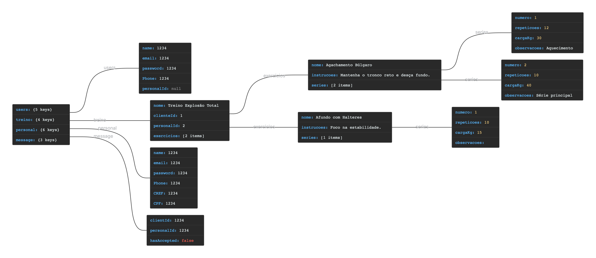
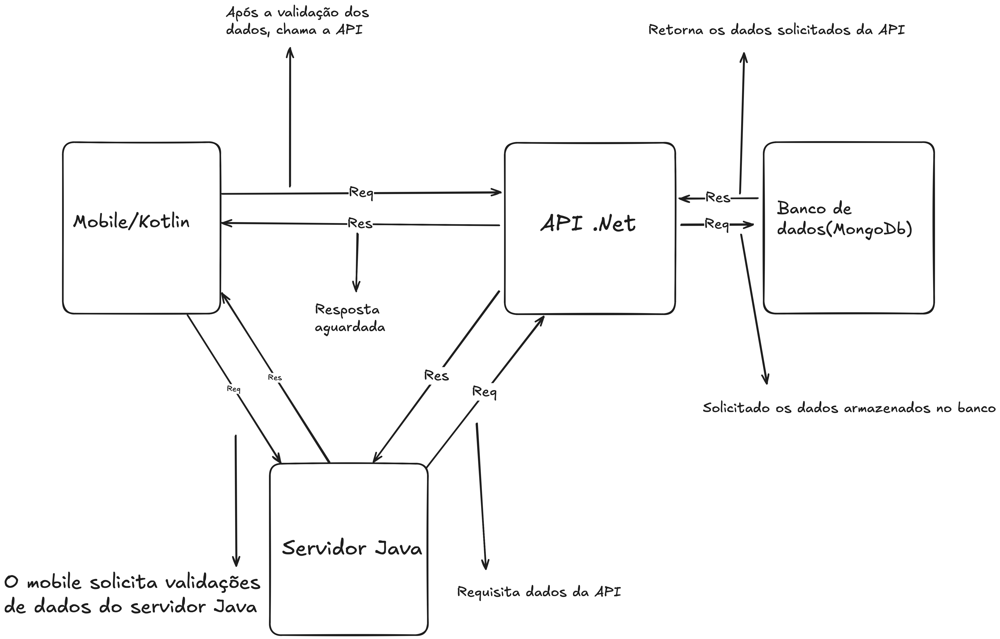

# FitLink-PI4-Turma2-18
Repositório para desenvolvimento do projeto FitLink. 

REQUISITOS FUNCIONAIS:
 
RF001-Cadastro de Aluno
 
RF002-Cadastro de Personal
 
RF003-Login de usuário
 
RF004-Buscar personal
 
RF005-Solicitar vínculo de serviço com personal
 
RF006-Consultar treino atua
 
RF007-Visualizar e editar perfil
 
RF008-Finalizar vínculo de serviço com personal/aluno
 
RF009-Home Personal / Dashboard alunos
 
RF010-Visualizar informações dos treinos
 
RF011-Visualizar perfil do aluno
 
RF012-Gerenciar treinos (CRUD)
 
RF013-Adicionar exercício
 
RF014-Remover exercício
 
RF015-Logout

REQUISITOS DESEJÁVEIS:
 
RF001-Recuperação de senha
 
RF002-Complemento de cadastro - Anamnese e avaliação física
 
RF003-Buscar personal - filtro de tags
 
RF004-Chat entre aluno e personal
 
RF005-Registrar treino concluído
 
RF006-Consultar histórico de treino
 
RF007-Visualizar informações dos treinos registrados
 
RF008-Excluir conta

## Figma
https://www.figma.com/design/Efvczakc3PwfmRISysC4Dn/FitLink?node-id=0-1&t=ivXNQtj6SU9PJfx8-1

Servidor Java:

O servidor será desenvolvido utilizando a linguagem Java, sendo responsável por atuar como uma ferramenta central de validação de dados dentro do sistema. Ele terá como principal função garantir a integridade, consistência e segurança das informações trafegadas entre o cliente e o banco de dados.
Através da implementação de rotinas de verificação, o servidor irá validar formatos, tipos e regras de negócio antes que os dados sejam armazenados ou processados.

MongoDB:

No banco de dados MongoDB do projeto serão armazenadas três coleções principais: users, treino e personal.
A coleção users guarda as informações dos clientes, incluindo nome, e-mail, senha, telefone e, opcionalmente, um identificador do personal trainer (personalId).
A coleção personal contém os dados dos profissionais de educação física, como nome, e-mail, senha, telefone, CREF e CPF.
Já a coleção treino registra os treinos personalizados, com o nome do treino, o identificador do cliente (clienteId), o identificador do personal responsável (personalId) e uma lista de exercícios. Cada exercício possui nome, instruções e uma ou mais séries, que detalham o número da série, o número de repetições, a carga utilizada (em kg) e observações adicionais.

Processo Escolhido:

O desenvolvimento seguiu uma metodologia ágil baseada em Scrum, com sprints semanais e reuniões .de acompanhamento. As tarefas foram organizadas em um board Git Project, e o controle de versão foi realizado via GitHub.

Arquitetura Resumida:

EndPoints:

### Aluno 
Client significa aluno

| Método   | Endpoint                                                            | Descrição                                          |
| ------   | ------------------------------------------------------------------- | -------------------------------------------------- |
| `POST `  | `/Client/register`                                                  | Realiza login do aluno                             |
| `POST`   | `/Client/login`                                                     | Cadastra um novo aluno                             |
| `GET`    | `/Client/getById/{id}`                                              | Busca um aluno por ID                              |
| `GET`    | `/Client/getByCity/{city}`                                          | Busca alunos por cidade                            | 
| `GET`    | `/Client/getClientsByPersonalTrainer/{personalTrainerId}`           | Busca alunos de um personal                        | 
| `GET`    | `/Client/verifyIfIsLinkedToPersonal/{clientId}/{personalTrainerId}` | Verifica se o aluno está vinculado àquele personal | 
| `PATCH`  | `/Client/update/{id}`                                               | Atualiza os dados de um aluno                      |
| `DELETE` | `/Client/delete/{id}`                                               | Deleta o registro de um aluno                      |
| `PATCH`  | `/Client/linkToPersonal/{clientId}/{personalTrainerId}`             | Faz o vínculo entre um aluno e um personal         |                                         
| `PATCH`  | `/Client/closeLinkWithPersonal/{clientId}`                          | Fecha o vínculo entre um aluno e um personal       |
| `PATCH`  | `/Client/addInformations/{clientId}`                                | Adiciona informações adicionais do aluno           |              

### Personal 

| Método   | Endpoint                                                | Descrição                                       |
| ------   | --------------------------------------------------------| ------------------------------------------------|
| `POST `  | `/Personal/register`                                    | Realiza login do personal                       |
| `POST`   | `/Personal/login`                                       | Cadastra um novo personal                       |
| `GET`    | `/Personal/getById/{personalId}`                        | Busca um personal por ID                        |
| `GET`    | `/Personal/getByCity/{city}`                            | Busca personais por cidade                      | 
| `PATCH`  | `/Personal/update/{personalId}`                         | Atualiza os dados de um personal                |
| `DELETE` | `/Personal/delete/{id}`                                 | Deleta o registro de um personal                |
| `PATCH`  | `/Personal/addMoreInformations/{personalId}`            | Adiciona informações adicionais de um personal  |

### Treino 

| Método   | Endpoint                                                | Descrição                                       |
| ------   | --------------------------------------------------------| ----------------------------------------------- | 
| `POST `  | `/Train/register`                                       | Realiza o registro de um treino                 |
| `GET`    | `/Train/getById/{id}`                                   | Busca um treino por ID                          |
| `GET`    | `/Train/getByClientId/{clientId}`                       | Busca um treino pelo id do aluno                |   
| `PATCH`  | `/Train/getTrainsByPersonalId/{personalId}`             | Busca os treinos de um personal                 |
| `PATCH`  | `/Train/update/{trainId}`                               | Atualiza os dados de um treino                  |
| `DELETE` | `/Train/deleteById/{trainId}`                           | Deleta o registro de um treino                  |

## Mensagem

| Método   | Endpoint                                                | Descrição                                       |
| ------   | --------------------------------------------------------| ------------------------------------------------|
| `POST `  | `/Message/register`                                     | Realiza o registro de uma mensagem              |
| `GET`    | `/Message/getByMessageId/{messageId}`                   | Busca uma mensagem por ID                       |
| `GET`    | `/Message/getAllMessagesByPersonalId/{personalId}`      | Busca as mensagens de um personal               | 
| `DELETE` | `/Message/delete/{messageId}`                           | Deleta o registro de uma mensagem               |

## Processo
O processo escolhido foi o de cadastro de aluno, criar uma conta para um aluno.
O projeto conta com 3 projetos menores, que se relacionam.
 
<ul>
  <li>Aplicativo Mobile</li>
  <li>Server Java</li>
  <li>API .Net</li>
</ul>

## Arquitetura 

Intruções de Execução:

1 - Clonar o repositório
git clone https://github.com/usuario/FitLink-PI4-Turma2-18.git
cd FitLink-PI4-Turma2-18

2 - Executar o servidor Java
javac Servidor.java
java Servidor 3000

3 - Executar aplicativo Mobile

4 - Executar api .Net

5 - Certifique-se de que o MongoDB está em execução
mongod

## Testes

Testes para o processo de validação de dados do cadastro de um aluno

<table>
  <tr>
    <th>Cenário</th>
    <th>Sequências INTERCLASSES para testar Cenário Solicitado</th>
  </tr>

  <tr>
    <td>NORMAL</td>
    <td>SignUpClientValidator().validate(nomeValido, emailValido, senhaValida, telefoneValido, cidadeValida)</td>
  </tr>

  <tr>
    <td>VARIAÇÃO 1</td>
    <td>SignUpClientValidator().validate(nomeInvalido, emailValido, senhaValida, telefoneValido, cidadeValida)</td>
  </tr>

  <tr>
    <td>VARIAÇÃO 2</td>
    <td>SignUpClientValidator().validate(nomeValido, emailInvalido, senhaValida, telefoneValido, cidadeValida)</td>
  </tr>

  <tr>
    <td>VARIAÇÃO 3</td>
    <td>SignUpClientValidator().validate(nomeValido, emailValido, senhaInvalida, telefoneValido, cidadeValida)</td>
  </tr>

  <tr>
    <td>VARIAÇÃO 4</td>
    <td>SignUpClientValidator().validate(nomeValido, emailValido, senhaValida, telefoneInvalido, cidadeValida)</td>
  </tr>

  <tr>
    <td>VARIAÇÃO 5</td>
    <td>SignUpClientValidator().validate(nomeValido, emailValido, senhaValida, telefoneValido, cidadeInvalida)</td>
  </tr>
</table>

### Massa de dados
<b>OBS: No resultado esperado ele deve retornar uma classe ValidationResult, onde tem um boolean se passou na validação ou não, e uma mensagem de erro. No resultado esperado/obtido será representado da seguinte forma: true, "". Sendo primeiro o boolean e o segundo a mensagem dele</b>

<table>
  <tr>
    <th>Cenário</th>
    <th>Nome</th>
    <th>Email</th>
    <th>Senha</th>
    <th>Telefone</th>
    <th>Cidade </th>
    <th>Resultado esperado</th>
    <th>Resultado obtido</th>
  </tr>

  <tr>
    <td>NORMAL</td>
    <td>vitor</td>
    <td>vitor@gmail.com</td>
    <td>vitor123</td>
    <td>19983242758</td>
    <td>São Paulo</td>
    <td>true, ""</td>
    <td>true, ""</td>
  </tr>

  <tr>
    <td>VARIAÇÃO 1</td>
    <td>vi</td>
    <td>vitor@gmail.com</td>
    <td>vitor123</td>
    <td>19983242758</td>
    <td>São Paulo</td>
    <td>false, "Nome Precisa ter no mínimo 3 caracteres!"</td>
    <td>false, "Nome Precisa ter no mínimo 3 caracteres!"</td>
  </tr>

  <tr>
    <td>VARIAÇÃO 2</td>
    <td>vitor</td>
    <td>vitor.com</td>
    <td>vitor123</td>
    <td>19983242758</td>
    <td>São Paulo</td>
    <td>false, "Email mal formatado!"</td>
    <td>false, "Email mal formatado!"</td>
  </tr>

  <tr>
    <td>VARIAÇÃO 3</td>
    <td>vitor</td>
    <td>vitor@gmail.com</td>
    <td>vi</td>
    <td>19983242758</td>
    <td>São Paulo</td>
    <td>false, "Senha Precisa ter no mínimo 3 caracteres!"</td>
    <td>false, "Senha Precisa ter no mínimo 3 caracteres!"</td>
  </tr>

  <tr>
    <td>VARIAÇÃO 4</td>
    <td>vitor</td>
    <td>vitor@gmail.com</td>
    <td>vitor123</td>
    <td>1998324275</td>
    <td>São Paulo</td>
    <td>false, "Telefone precisa ter 11 caracteres!"</td>
    <td>false, "Telefone precisa ter 11 caracteres!"</td>
  </tr>

  <tr>
    <td>VARIAÇÃO 5</td>
    <td>vitor</td>
    <td>vitor@gmail.com</td>
    <td>vitor123</td>
    <td>1998324275</td>
    <td>Sa</td>
    <td>false, "Cidade Precisa ter no mínimo 3 caracteres!"</td>
    <td>false, "Cidade Precisa ter no mínimo 3 caracteres!"</td>
  </tr>
</table>

